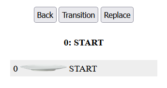
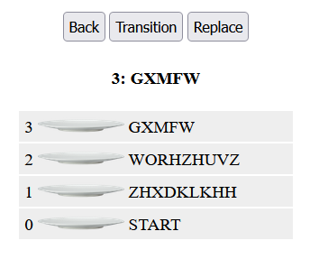

# useVisualMode Visualizer

1. Copy this repo using "Use This Template"

2. Clone repo: `git clone <repo url>`

3. Install the project: `npm install`

4. Start the App:  `npm start`  You will see a dish and some buttons that do nothing :-) 

5. Edit `src/hooks/useVisualMode.js`.  Replace with your `useVisualMode` Hook

6. Add `history` to the returned Object in `useVisualMode`.  Without this the progam will crash

7. If your useVisualMode is working, now the buttons work

6. The bold text is `mode`. If mode is the top dish, your hook is working.   *Did you forget Step 6?*
